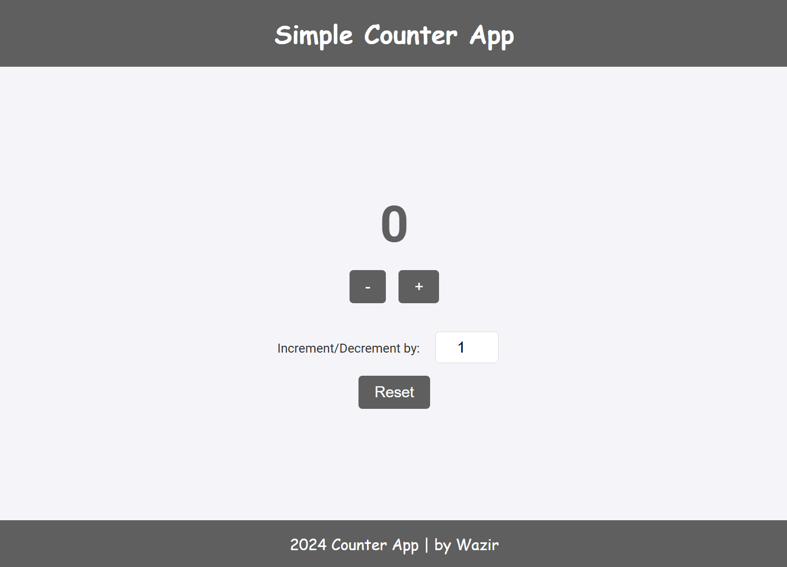

# Counter Project
This is a simple counter app built using HTML, CSS, and JavaScript. It allows users to increment, decrement, and reset the counter, with an option to customize the increment/decrement value and a button to Reset it back to 0

- ### Here is [Counter Project](https://mycounterbash.netlify.app/) link.

## Preview

### Image :

    

