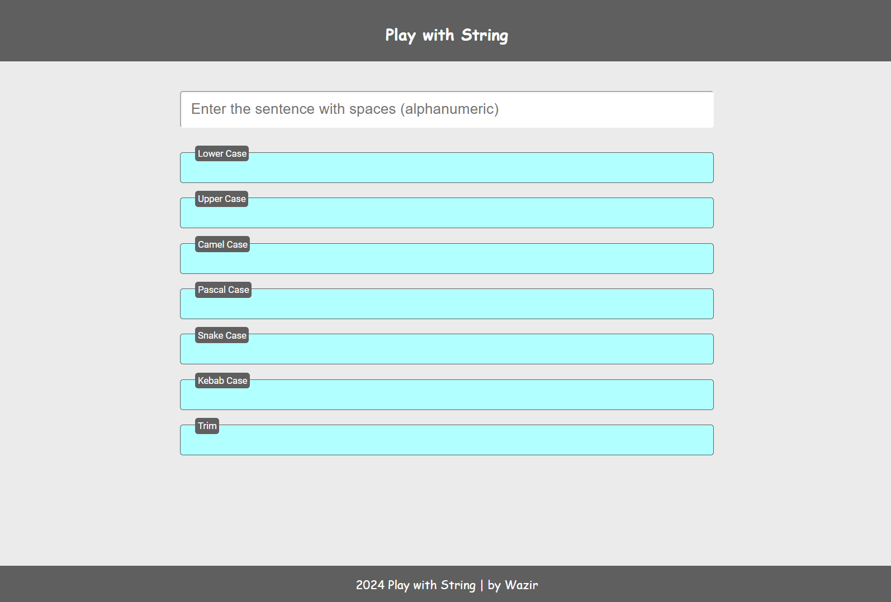

# Play with Strings
This project transforms a user-inputted string into various text formats like lowercase, uppercase, camel case, pascal case, snake case, and kebab case. It's a simple, interactive tool built with HTML, CSS, and JavaScript. try it Out!

- ### Here is [Play with String](https://playwithstringbash.netlify.app/) link.

## Preview

### Image :

    

