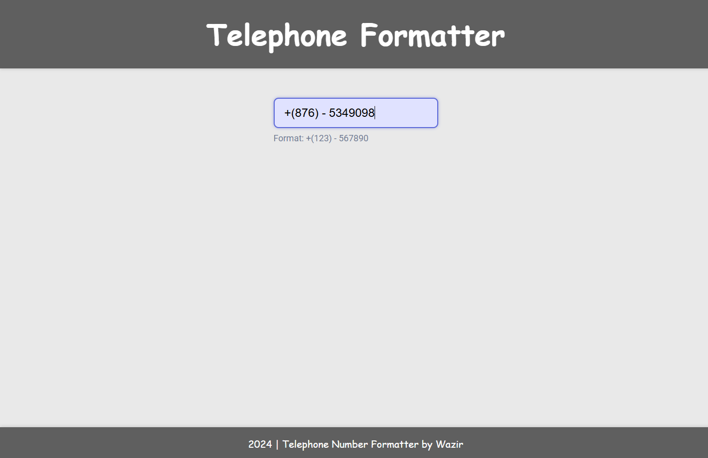

# Telephone Number Formatter
A simple web application that formats phone numbers dynamically as you type, ensuring a consistent and user-friendly format. Built with HTML, CSS, and JavaScript for practice and demonstration purposes. try it Out!

- ### Here is [Telephone Number Formatter](https://telephonenumberformatter.netlify.app/) link.

## Preview

### Image :

    

