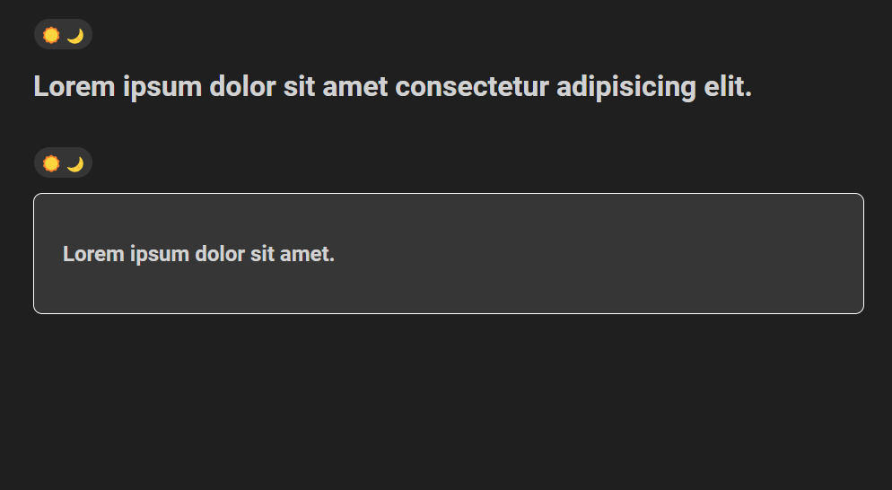

# Light and Dark Mode
A simple Light and Dark Mode toggle page with an additional contained dark mode feature for a specific section. Includes Local storage concept to prevent changing state on reloading of the page. try it Out!

- ### Here is [Light and Dark Mode](https://telephonenumberformatter.netlify.app/) link.

## Preview

### Image :

    

    

    

