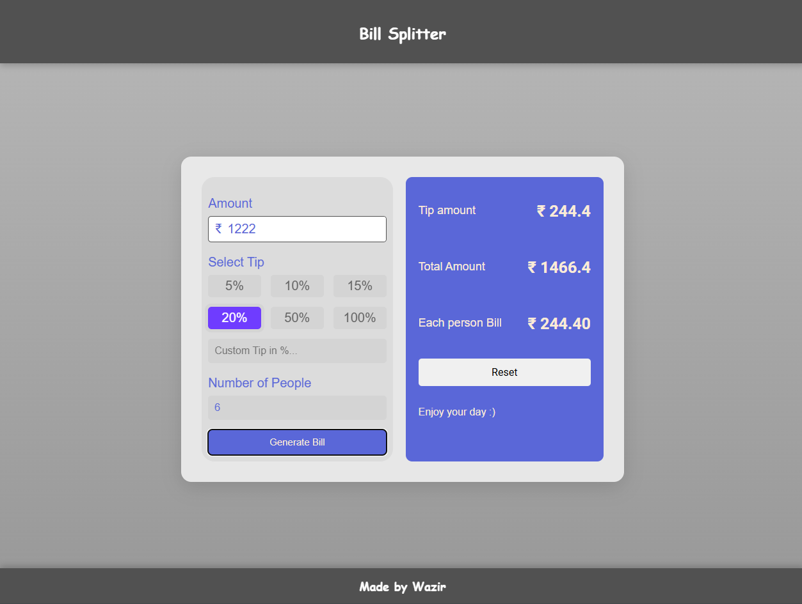

# Bill Splitter
this Bill Splitter app allows users to input the total bill amount, select a tip
percentage, and enter the number of people. It then calculates the tip, total bill,
and each person's share, with a clean and responsive design. Try it out!.

- ### Here is [Bill Splitter](https://billsplitterbash.netlify.app/) live link.

## Preview Image :

    

