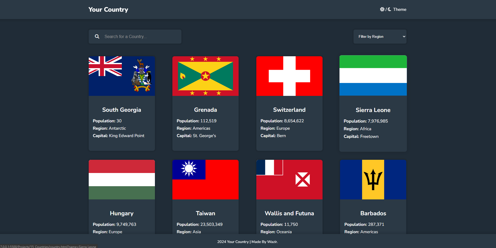

# Your Country
This Project is a dynamic website that allows users to explore countries by searching or filtering them based on regions. It features modern design with day/night theme toggle with sticky header and footer and supports responsive layout. Each country is shown as a card with details which on tapping will redirect you to the page where you'll find respective details.

## Overview

Users can:

- See all countries from the API on the homepage
- Search for a country using an `input` field
- Filter countries by region
- Click on a country to see more detailed information on a separate page
- Click through to the border countries on the detail page
- Toggle the color scheme between light and dark mode 
- API used: `https://restcountries.com/`

### Screenshot
- Home Page:
<p align="center">
    
</p>

- Country Detail
<p align="center">
    
</p>

### Live Link

- Live Site URL: [Your Country](https://whereisyourcountry.netlify.app/)

### Built with

- HTML
- CSS custom properties
- JavaScript
- Flexbox
- CSS Grid
- Media query for mobile view

### What I learned

- Extensively learned about API and its functionality
- JavaScript `fetch()` function
- implementing `.then` on promises
- parsing the data and then updating the DOM with the new information
- DOM concepts
 
#### Code example: 
```js
fetch('https://restcountries.com/v3.1/all')
  .then((res) => res.json())
  .then((data) => {
    renderCountries(data)
    allCountriesData = data
  })
```

### Issues
- Some countries might be missing or have incomplete data due to API Limitations. 
- You could refer to this API - `https://restcountries.com/`