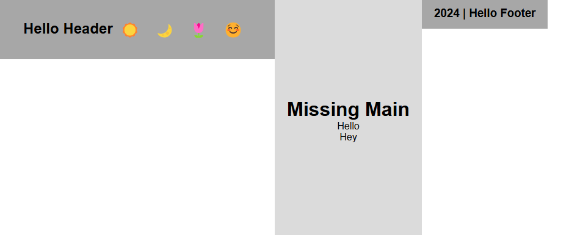
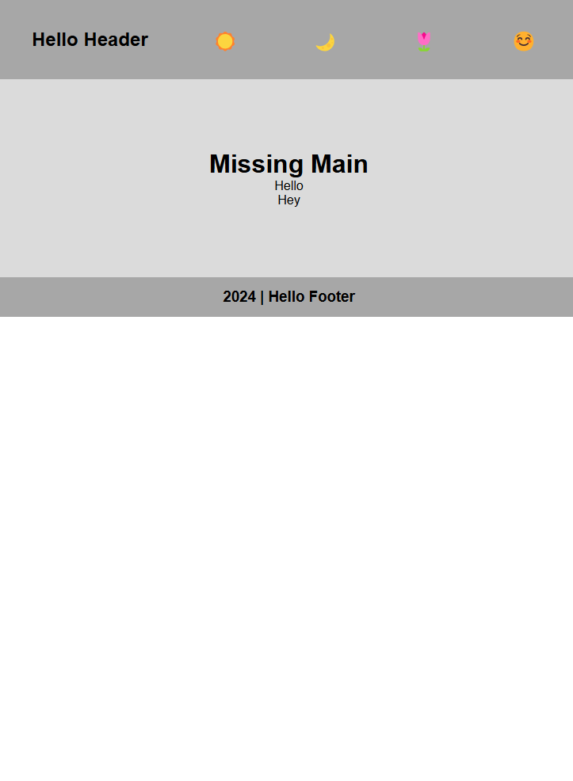
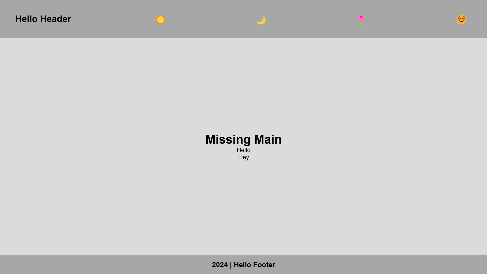

# Aligning `header/main/footer` with respect to `Viewport`

## Align Header, Main and Footer Centered Vertically 

### Using `Flexbox`

**Apply these on the body**
- `display: flex;` to enable flexbox (which automatically flex header, main, and footer horizontally)
<p>
    
</p>

- `flex-direction: column;` flex header, main, and footer vertically (will occupy the height of the body)
<p>
    
</p>

- `justify-content: space-between;`
- `height: 100vh;` Make the body fill the viewport height
- i've applied `flex:grow: 1` to make sure it takes up the remaining space (or we can use `height: 100%` to `main`, so that it can occupy all remaining height)

**CSS:**

```CSS
body {
  display: flex;
  flex-direction: column;
  justify-content: space-between; 
  height: 100vh;
}
```

<p align="center">
    
</p>

### Using `CSS Grid`

- `display: grid;` makes body a grid container
- `grid-template-rows: auto 1fr auto;` defines three rows: `auto` for the header and footer (they will take as much height as needed), and `1fr` for the main content, which will take the remaining space.
- `height: 100vh;` for occupying full viewport height

**CSS:**

```CSS
body {
  display: grid;
  grid-template-rows: auto 1fr auto;
  height: 100vh; 
}
```

<p align="center">
    
</p>

## Using `Absolute Positioning`
